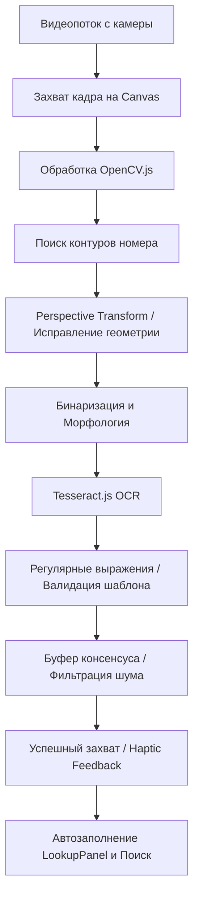

# Архитектура подсистемы распознавания номеров (LPR / OCR)

В приложении LPlates реализована полностью клиентская, легковесная и высокопроизводительная система оптического распознавания номерных знаков (**License Plate Recognition / LPR**). В отличие от классических ресурсоемких решений на базе нейросетей (таких как YOLO или RetinaNet), наша архитектура оптимизирована для работы в мобильных браузерах и PWA-окружении за счет синергии **OpenCV.js** и **Tesseract.js**.

---

## 🛠️ Схема конвейера обработки кадров (Pipeline)

Каждый кадр с камеры смартфона проходит многоэтапную цепочку обработки в реальном времени:

---

## 🔬 Подробное описание этапов

### 1. Компьютерное зрение (OpenCV.js)
Для локализации номерного знака и подготовки изображения используются оптимизированные алгоритмы фильтрации:
- **Детекция контуров**: Кадр переводится в градации серого, применяется размытие по Гауссу для устранения шумов и детектор границ Кэнни (Canny Edge Detection).
- **Поиск прямоугольника**: Алгоритм ищет четырехугольники с соотношением сторон, близким к стандартному автомобильному номеру (около `4:1`–`5:1`).
- **Коррекция геометрии (Warp Perspective)**: При обнаружении подходящего четырехугольника вычисляется матрица трансформации, которая «выпрямляет» номер под прямым углом. Это критически важно для корректной работы распознавания букв при съемке под наклоном.
- **Предобработка текста**: Применяется адаптивная бинаризация (Thresholding) для повышения контрастности символов и морфологическая операция закрытия (Morphological Closing) для соединения разрывов в начертании букв.

### 2. Распознавание символов (Tesseract.js)
Оптимизация OCR-движка позволила снизить время распознавания до **~100–180мс** на кадр:
- **Вайтлист символов**: В движок Tesseract передан строгий список разрешенных символов: латиница (`A-Z`), кириллица (`А-Я`) и цифры (`0-9`). Это исключает распознавание спецсимволов и мусора.
- **Повторное использование воркера**: Воркер Tesseract инициализируется один раз при открытии камеры и повторно используется для всех кадров, освобождая память при закрытии.
- **Управление ресурсами**: Благодаря Page Visibility API обработка кадров мгновенно приостанавливается, если вкладка приложения свернута, сохраняя заряд аккумулятора устройства.

### 3. Валидация и фильтрация шума
Сырой вывод от OCR-движка проходит через два фильтра защиты от ложных срабатываний:
- **Регулярные выражения (Regex)**: Номер проверяется на соответствие строгим национальным шаблонам. Для России это ГОСТ Р 50577-93 (например, `^[АВЕКМНОРСТУХ]\d{3}[АВЕКМНОРСТУХ]{2}\d{2,3}$`), для ЕС — соответствующие региональные стандарты.
- **Буфер консенсуса (Consensus Buffer)**: Чтобы избежать случайных мерцаний и ошибочно распознанных символов, результат фиксируется только тогда, когда один и тот же номер распознается в нескольких кадрах подряд (по умолчанию — 3 кадра).

---

## 🎨 Премиальный UX и Дизайн

Интерфейс видоискателя спроектирован в соответствии с современными дизайн-системами:
- **Физические пропорции**: Рамка видоискателя [CameraScanner-Viewfinder](file:///Users/basilred/sandbox/lplates/src/components/CameraScanner/CameraScanner.css) имеет точное соотношение сторон `520 / 112`, соответствующее физическому размеру знаков РФ/ЕС (520×112 мм).
- **Светодиодный статус-индикатор**: Пульсирующий маркер информирует пользователя о текущей фазе (оранжевый при обнаружении текста, зеленый при стабилизации результата).
- **Реалистичный результат**: Распознанный номер отображается в виде глянцевой пластины с синим европейским флагом слева, рамкой и золотой звездой `★`.
- **Haptic Feedback (Виброотклик)**: При фиксации номера приложение генерирует легкий виброимпульс (через `navigator.vibrate`), создавая приятное тактильное подтверждение.

---

## 🧪 Покрытие тестами (E2E)

Интеграция протестирована во всех современных браузерных движках (Chromium, Webkit, Firefox) с помощью **Playwright**:
- Имитируется поток кадров с камеры.
- Реализованы моки для `navigator.mediaDevices.getUserMedia`.
- Эмулируется успешный захват с помощью шины событий `__test_ocr_capture__`.
- Поведение при отказе в доступе к камере проверяется через ограничение прав контекста (`clearPermissions()`).
